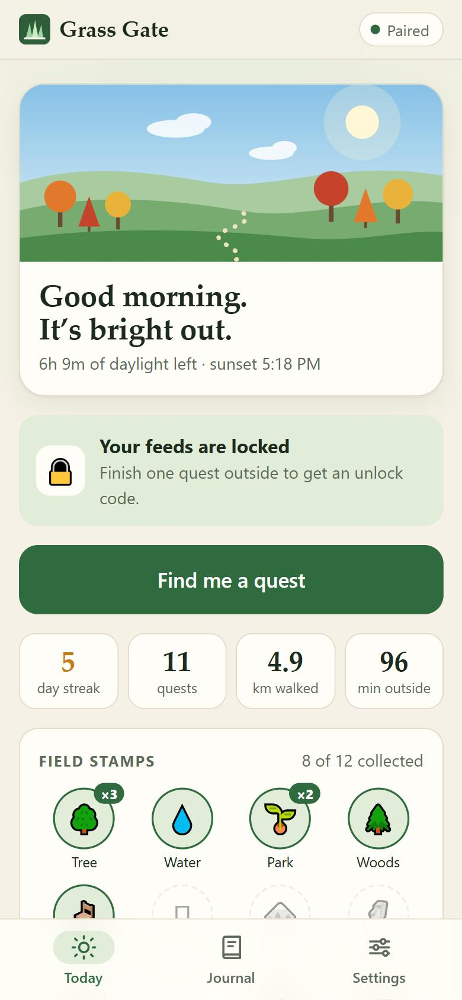
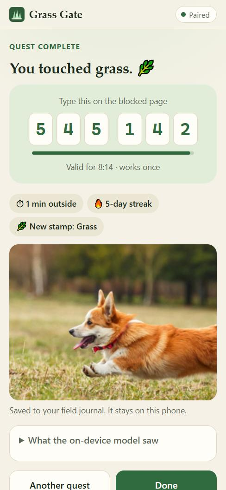
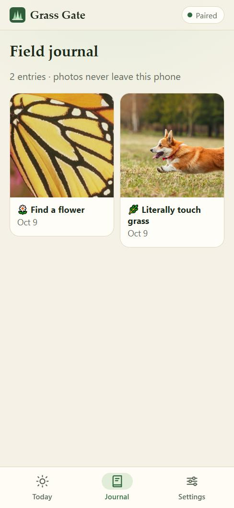
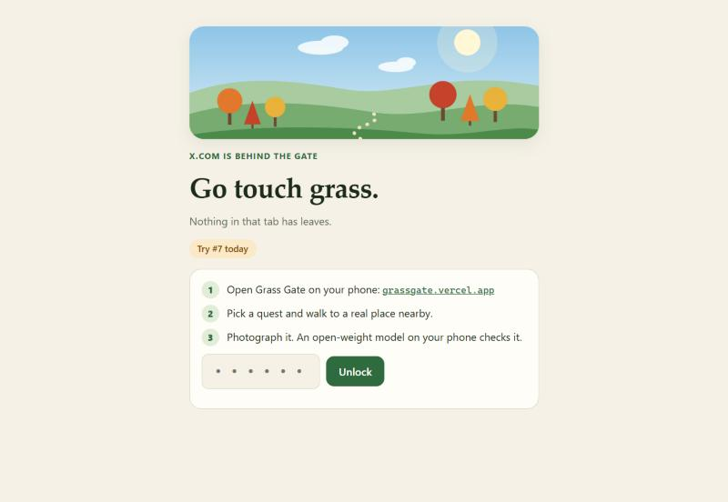
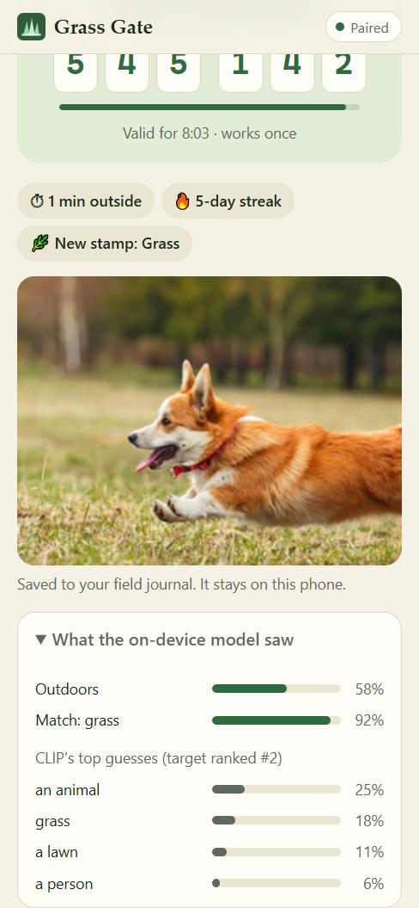

*This is a submission for the [Hacktoberfest Open-Source AI Challenge Week 1: Touch Grass](https://dev.to/challenges/hacktoberfest-week1-2026-10-05)*

## What I Built

**Grass Gate is a doomscroll lock that only opens outdoors.**

A browser extension blocks the sites I lose hours to. When I hit one, I don't get a guilt-trip timer. I get a quest. I open Grass Gate on my phone, and it picks a real place near me from OpenStreetMap:

> 💧 *Mallard Lake is 330 m south. Walk there and photograph the water.*

I pocket the phone and walk. When I arrive, it buzzes and chimes. I take the photo, and an open-weight vision model **running on the phone** checks two things: am I actually outdoors, and is that actually water? If both pass, I get a one-time 6-digit code. I type it into the blocked page, and my feeds open for 30 minutes. Then they lock again.

The screen is only the lock. Everything that counts happens outside.

| Today | Quest complete | Field journal |
|:---:|:---:|:---:|
|  |  |  |

It's for anyone whose thumb opens a feed before their brain has decided to, which is me. A few things make it more than a gimmick:

- **Real places, not "go for a walk."** Quests come from what's actually mapped near you: trees, lakes, parks, benches, viewpoints, public art. Each shows a walking time and direction.
- **Pocket navigation.** A compass arrow that turns with your phone, a progress ring, and a buzz when you arrive, so you aren't staring at the screen on the way.
- **A field journal.** Every finished quest is saved with its photo, place and time, on the phone only.
- **Streaks, km walked, minutes outside, and 12 collectible stamps,** one per quest type.
- **A home screen that follows the real sky.** The landscape changes with the time of day and season, with a line like "2h 10m of daylight left · sunset 6:44 PM", worked out on the device.
- **The blocked page keeps count:** "Try #7 today." Seeing that number does more than any timer did for me.



## Demo

**Try it on your phone: [grassgate.vercel.app](https://grassgate.vercel.app/)**

Open it in your phone's browser, allow location and camera, and tap **Find me a quest**. Add it to your home screen to install it. After the first photo check, the vision model is cached and works without signal.

The app works on its own: quests, the on-device photo check, the journal, streaks and stamps. The browser extension adds the lock, and the 6-digit code from a finished quest unlocks it. Want to try it at your desk? Turn on **Demo mode** in Settings to skip the walking distance check.

<!-- TODO: 60-second video of one real quest -->

## Code

<!-- TODO: GitHub repo embed -->

The whole app is plain HTML, CSS and JavaScript: a PWA you can install, about 100 KB of app code, with no bundler and no backend. The extension is a Chrome Manifest V3 extension.

## How I Built It

```
 Laptop (Chrome extension)                      Phone (PWA)
 declarativeNetRequest blocks feeds             GPS → OpenStreetMap (Overpass) → nearby features
 "Go touch grass" page                          → quest: tree / water / park / bench / art / view
                                                [optional] local LLM writes the quest text
        shared pairing secret                   walk; camera unlocks within ~40–150 m
  ◀──── (typed once, never sent anywhere) ────▶ CLIP ViT-B/32 checks the photo on-device
 checks the 6-digit code offline   ◀── code ──  pass → one-time code (valid 5–10 min)
```

**1. CLIP ViT-B/32 via transformers.js: the referee.** The open-weight [CLIP](https://huggingface.co/Xenova/clip-vit-base-patch32) model runs in the browser through [transformers.js](https://github.com/huggingface/transformers.js) (about 155 MB, downloaded once and cached). Zero-shot classification means I didn't train anything: the classifier's "knowledge" is just a list of English labels, the same trick described in [Is this even a valid card? Zero-shot image classification model in a lambda container](https://dev.to/aws-builders/is-this-even-a-valid-card-zero-shot-image-classification-model-in-a-lambda-container-58oj). Mine runs on the phone instead of in a Lambda.

Each photo gets two checks:

- **Outdoors?** "outdoors / nature / a street" vs "indoors / a room / a screen". I tuned this on sample photos: outdoor ones scored 0.56–0.86 and indoor ones 0.20–0.29, so the cutoff is 0.5. It also rejects a photo of a tree on your monitor.
- **Is it the target?** This is where I got it wrong first.

My first version added up the scores of every synonym: *water + a river + a pond + a lake + a fountain*. During end-to-end testing with a simulated camera, a photo of **a beach towel and a book on sand** passed the water quest at 41%. Nothing in the photo was water. With five water labels among thirteen, the target collects about 38% of the probability before the model has looked at anything. My cutoff was 35%.

The fix uses the fact that softmax keeps logit differences, so `ln(p_a / p_b) = logit_a − logit_b`:

```js
// Best target label must rank top-3 AND beat the median decoy by ~2.7×.
const logit = Object.fromEntries(target.map((r) => [r.label, Math.log(r.score)]));
const best = Math.max(...quest.labels.map((l) => logit[l]));
const decoyLogits = decoys.map((l) => logit[l]).sort((a, b) => a - b);
const margin = best - decoyLogits[Math.floor(decoyLogits.length / 2)];
const rank = target.findIndex((r) => quest.labels.includes(r.label)) + 1;
const targetOk = margin >= 1.0 && rank <= 3;
```

With 18 decoys ("sand", "a pavement", "an animal", "a book"…), all 7 of my sample photos now land correctly. The towel fails with *"Couldn't spot water. It looked more like a book."* A butterfly on a flower and a dog on grass pass. Seven photos is a small set, so these thresholds will keep moving as I test outside. Because they're plain numbers in my own code, I can move them.

The app shows its working, too. Under every result, "What the on-device model saw" lists the real scores. Here, "an animal" is CLIP's top guess, but grass still ranks #2 and clears the margin easily:



**2. OpenStreetMap via the Overpass API: the quest-giver.** A single Overpass query pulls trees, water, parks, woods, benches, playgrounds, viewpoints and public art within your chosen radius. Quests are at least 120 m away so you actually walk, and the last map is cached so it keeps working without signal. If nothing is mapped nearby, or you're offline, you get "anywhere" quests: sky, leaf, flower, grass.

**3. An optional local LLM via WebLLM: the narrator.** With WebGPU, an open-weight model running in the browser (Gemma 2 2B, Qwen2.5 0.5B or Llama 3.2 1B, swappable in settings) rewrites each quest so it reads like a friend nudging you outside. **The LLM never decides anything that matters.** Quest types, CLIP labels and geofences are deterministic. The model only gets facts I already have (place name, distance, direction, season) and writes the words. A tiny or swapped model can make the text worse, but it can't send you to a place that doesn't exist.

**4. No server at all.** The phone and the extension share a secret once, by link or by typing a 16-character code. Unlock codes are HMAC-SHA256 of that secret and a 5-minute time window, the same idea as TOTP, checked offline on both sides. Each quest gives exactly one code: the extension refuses reuse and rate-limits wrong guesses.

## Why Does Open Innovation Matter?

Because the core of this app is **a daily, geotagged photo of where I live and walk.** Grass Gate isn't something I'd ship on a closed vision API.

| | Grass Gate (open, on-device) | Same idea on a closed API |
|---|---|---|
| **Your photos** | Never leave the phone | A daily photo trail of your neighbourhood on someone else's server |
| **Signal** | Works on a trail after one model download | Every check needs a connection |
| **Cost** | $0 per check, no keys, no rate limits | Paid per image, plus a backend to hide the key |
| **Server** | None | Needed for state and for the API key |
| **Control** | I read the model's scores, retuned the thresholds, and fixed the towel bug in an afternoon | A yes/no from a black box I can't calibrate |

The last row is where open won the hardest. The beach-towel bug was only fixable because I could see the full probability distribution and work back to the logits. A closed "does this photo contain water?" endpoint would have said *yes*, and I'd have had no way to know why.

There are honest trade-offs. The first CLIP download is about 155 MB, and ViT-B/32 is not the sharpest model available. But it's small enough to run on a phone, and good enough to tell a lake from a towel.

## Prize Categories

- **Best Use of Gemma:** Gemma 2 2B runs fully in the browser through WebLLM as the quest writer, so no quest text or location context leaves the phone.
